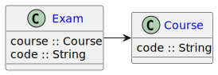
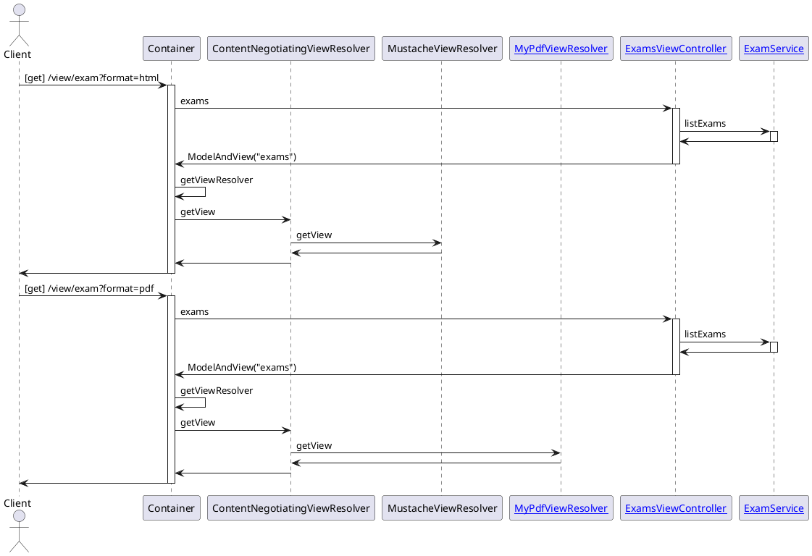
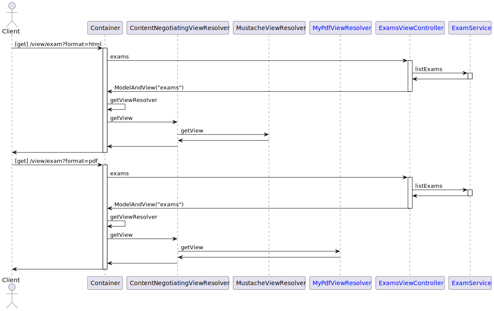

# View Resolvers

### Design

#### Simple Model

```puml
@startuml class

class "[[https://github.com/johnlayton/nokescourt/blob/main/src/main/java/org/nokescourt/model/Course.java Course]]" as Course {
  code :: String 
}

class "[[https://github.com/johnlayton/nokescourt/blob/main/src/main/java/org/nokescourt/model/Exam.java Exam]]" as Exam {
  course :: Course
  code :: String
}

Exam -> Course

@enduml
```

<!--

-->



#### Simple Access
<!--

-->


### Setup

```shell
devbox install
```

### Generate Documentation

```shell
devbox run plantuml -tsvg -o docs README.md
```

```shell
devbox run documentation
```

### Run

```shell
devbox 'run gradle --gradle-user-home .gradle --console=rich --build-cache bootRun'
```

```shell
devbox run server
```

### Test Rest Controller

```shell
devbox run 'curl --header "Accept: application/json" "http://localhost:8080/rest/exams"  | jq -r .'
```

```shell
devbox run 'curl --header "Accept: application/xml" "http://localhost:8080/rest/exams" | xq'
```

### Test View Controller

```shell
devbox run 'curl --header "Accept: application/json" "http://localhost:8080/view/exams" | jq -r .'
```

```shell
devbox run 'curl --header "Accept: text/plain" "http://localhost:8080/view/exams"'
```

```shell
devbox run 'curl --header "Accept: text/html" "http://localhost:8080/view/exams"'
```

```shell
devbox run 'wget --header "Accept: application/pdf" -O exams.pdf "http://localhost:8080/view/exams"'
```

```shell
open "http://localhost:8080/view/exams?format=html"
```

```shell
open "http://localhost:8080/view/exams?format=txt"
```

```shell
open "http://localhost:8080/view/exams?format=pdf"
```

```shell
open "http://localhost:8080/view/exams?format=json"
```

### Show Actuator

```shell
open "http://localhost:8080/actuator"
```
