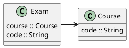
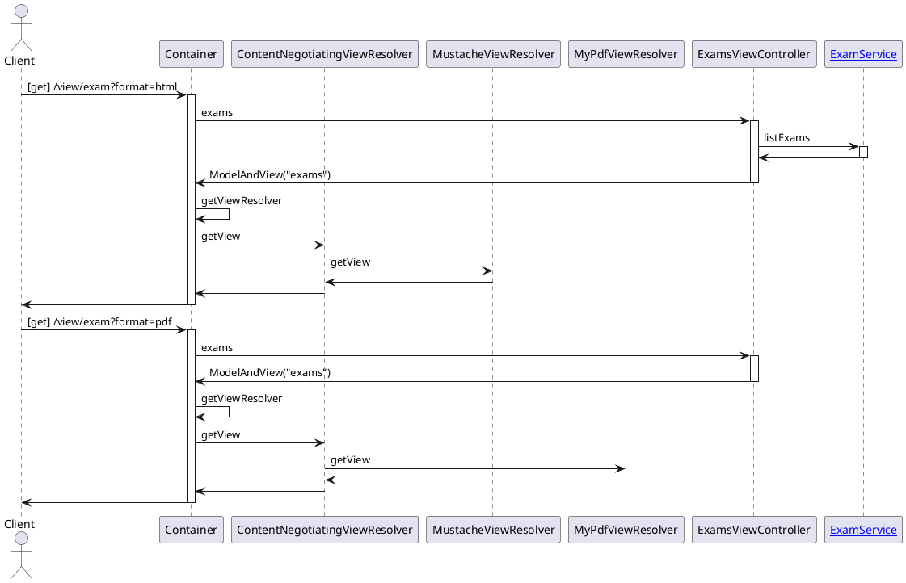

# View Resolvers

### Design;

#### Simple Model
<!--

-->


#### Simple Access
<!--

-->


### Setup;

```shell
devbox install
```

### Generate Documentation;

```shell
devbox run plantuml -tsvg -o docs README.md
```

### Run;

```shell
devbox run gradle bootRun
```

### Test Rest Controller;

```shell
curl --header "Accept: application/json" "http://localhost:8080/rest/exams"
```

```shell
curl --header "Accept: application/xml" "http://localhost:8080/rest/exams"
```

### Test View Controller;

```shell
curl --header "Accept: application/json" "http://localhost:8080/view/exams"
```

```shell
curl --header "Accept: text/plain" "http://localhost:8080/view/exams"
```

```shell
curl --header "Accept: text/html" "http://localhost:8080/view/exams"
```

```shell
open http://localhost:8080/view/exams?format=html
```

```shell
open http://localhost:8080/view/exams?format=txt
```

```shell
open http://localhost:8080/view/exams?format=pdf
```
